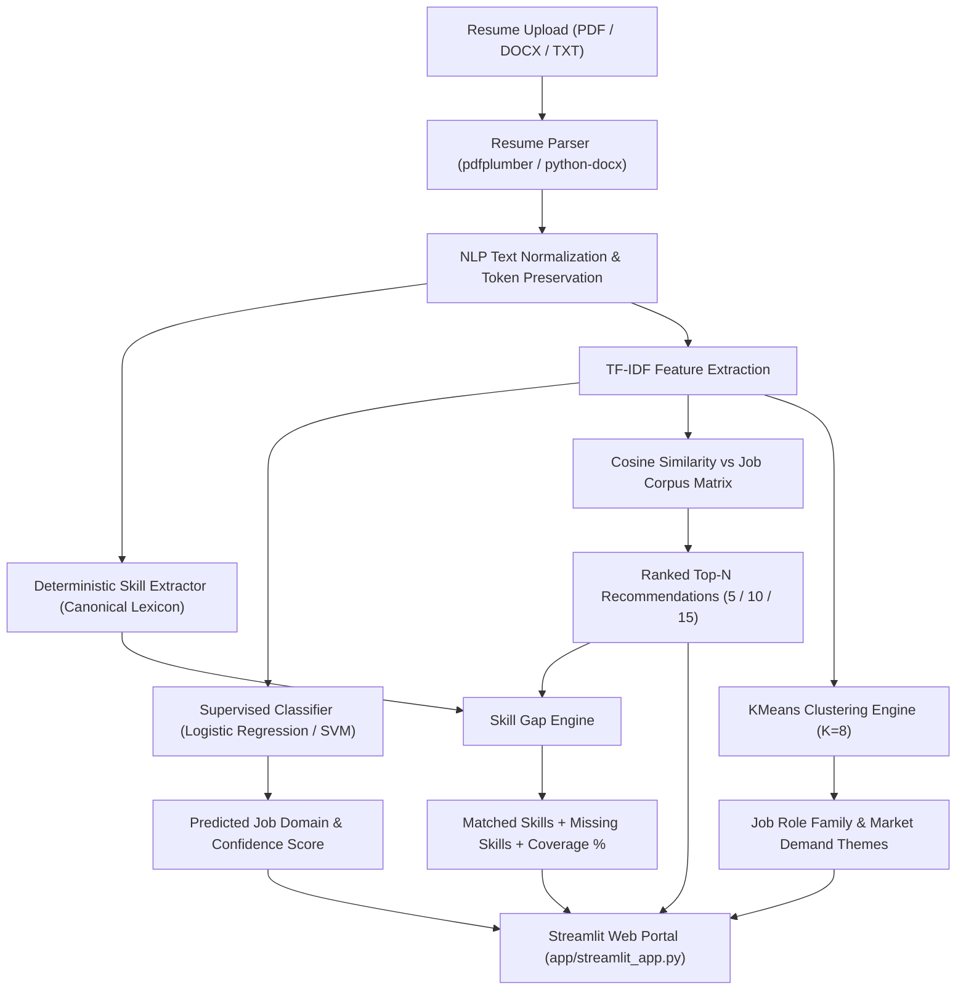

# SmartHire — Resume-to-Job Matching & Career Guidance Engine

An end-to-end Classical Machine Learning & Natural Language Processing system that parses candidate resumes, classifies candidate domain roles, recommends top matching job vacancies using vector-space content filtering, computes skill gaps, and generates data-driven career guidance.

---

## 📌 Project Overview & Problem Statement

Job seekers frequently encounter friction when tailoring their CVs to diverse job vacancies. At the same time, recruiters review thousands of unstructured applications.

**SmartHire** bridges this gap using transparent, explainable **classical machine learning**:
1. **Automated Resume Parsing**: Extracts structured text from PDF, DOCX, and TXT documents.
2. **Domain Classification**: Categorizes resumes into 25 technical domains using supervised learning.
3. **Content-Based Job Recommendation**: Matches candidates against a corpus of vacancies using TF-IDF vectorization and cosine similarity.
4. **Deterministic Skill Gap Analysis**: Maps candidate skills against job requirements to highlight matched vs. missing skills and calculate exact coverage.
5. **Role Family Clustering**: Uses unsupervised KMeans clustering to reveal natural job families and market demand themes.
6. **Candidate Fit Index**: Computes a defensible, multi-factor fit score without hallucinated labels.

> [!IMPORTANT]
> **Data Science & ML Integrity Guarantee:**
> - **Classical Machine Learning Only:** Strictly built with `scikit-learn`, `numpy`, `pandas`, `TF-IDF`, and `KMeans`.
> - **No Large Language Models (LLMs):** No OpenAI, Claude, Gemini, ChatGPT, or external generative AI inference APIs.
> - **No Live Scraping:** Uses static, publicly available research datasets in compliance with platform terms of service.
> - **No Fabricated Labels:** Transparently distinguishes between supervised classification (with ground-truth domain labels) and shortlisting fit (explainable composite scoring).

---

## 🏗️ System Architecture



---

## 📊 Dataset Information

1. **Updated Resume Dataset** (`data/raw/UpdatedResumeDataSet.csv`):
   - **Sample Count:** 962 resumes.
   - **Target Variable:** 25 domain categories (`Data Science`, `Java Developer`, `DevOps Engineer`, `Web Designing`, `HR`, `Testing`, etc.).
   - **Usage:** Supervised classification model training and evaluation.

2. **Naukri Job Listings Corpus** (`data/raw/naukri_com-job_sample.csv`):
   - **Sample Count:** 22,000 raw listings; 4,000 curated, deduplicated vacancies for high-speed inference.
   - **Fields:** `job_id`, `title`, `company`, `location`, `skills`, `description`, `experience`, `source`.
   - **Usage:** Recommender search matrix, unsupervised clustering, and market skill frequency analysis.

---

## 🧪 Actual Evaluation Results (Verified Execution)

All metrics documented below were generated through empirical execution on an 80/20 stratified test split (`random_state=42`).

### 1. Resume Domain Classifier

| Model | Accuracy | Macro Precision | Weighted Precision | Macro Recall | Weighted Recall | Weighted F1-Score |
| :--- | :---: | :---: | :---: | :---: | :---: | :---: |
| **Logistic Regression (Primary)** | **98.96%** | **98.90%** | **99.02%** | **98.80%** | **98.96%** | **98.97%** |
| Linear SVM (Calibrated) | 99.48% | 99.53% | 99.51% | 99.43% | 99.48% | 99.49% |

- **Confusion Matrix:** Saved to [`reports/figures/confusion_matrix.png`](file:///reports/figures/confusion_matrix.png).

### 2. Unsupervised Job Clustering (KMeans)

- **Cluster Size Optimization:** Evaluated across $K \in [4, 12]$.
- **Elbow Analysis:** Substantial inertia deceleration observed around $K = 8$.
- **Silhouette Score:** Optimal cluster cohesion and separation confirmed at $K = 8$ (Inertia: 3392.1).
- **PCA Visualization:** 2D projection saved to [`reports/figures/job_clusters_pca.png`](file:///reports/figures/job_clusters_pca.png).
- **Elbow & Silhouette Plots:** Saved to [`reports/figures/elbow_method.png`](file:///reports/figures/elbow_method.png) and [`reports/figures/silhouette_analysis.png`](file:///reports/figures/silhouette_analysis.png).

---

## 📂 Project Structure

```
smarthire/
├── README.md                           # Comprehensive documentation
├── requirements.txt                    # Pinned, cloud-compatible dependencies
├── .gitignore                          # Standard git ignore rules
│
├── data/
│   ├── raw/                            # Original raw datasets (never edited)
│   │   ├── UpdatedResumeDataSet.csv
│   │   └── naukri_com-job_sample.csv
│   ├── processed/                      # Preprocessed clean datasets
│   │   ├── resumes_clean.csv
│   │   └── jobs_clean.csv
│   └── sample_resumes/                 # Ready-to-use demo resumes (.pdf, .docx, .txt)
│       ├── sample_data_scientist.pdf
│       ├── sample_fullstack_dev.docx
│       └── sample_devops_engineer.txt
│
├── notebooks/                          # Interactive exploration notebooks
│   ├── 01_eda.ipynb                    # Exploratory Data Analysis & distributions
│   ├── 02_resume_classifier.ipynb      # Supervised classification experiments
│   ├── 03_recommender.ipynb            # Recommendation & cosine similarity tests
│   ├── 04_clustering_topics.ipynb      # KMeans, elbow method, silhouette & PCA
│   └── 05_fit_predictor.ipynb         # Fit scoring and shortlisting analysis
│
├── src/                                # Modular, reusable library code
│   ├── __init__.py
│   ├── config.py                       # Pathlib-based cross-platform paths
│   ├── evaluate.py                     # Standardized evaluation & plotting
│   │
│   ├── data/
│   │   ├── __init__.py
│   │   ├── load_data.py                # Schema validation and raw data loading
│   │   └── preprocess.py               # Text cleaning, normalization, corpus build
│   │
│   ├── features/
│   │   ├── __init__.py
│   │   ├── text_features.py            # Token protection, cleaning, skill extraction
│   │   └── match_features.py           # Skill gap & composite candidate fit scoring
│   │
│   ├── models/
│   │   ├── __init__.py
│   │   ├── classifier.py               # Model A: Supervised domain classifier
│   │   ├── recommender.py              # Core Engine: Content-based job recommender
│   │   ├── clustering.py               # Model C: KMeans job clustering
│   │   └── fit_predictor.py            # Model B: Candidate fit predictor
│   │
│   └── parsing/
│       ├── __init__.py
│       └── resume_parser.py            # Robust PDF, DOCX, and TXT parsing
│
├── models/                             # Compact, pre-trained serialized artifacts
│   ├── classifier.pkl
│   ├── classifier_vectorizer.pkl
│   ├── job_matrix.pkl
│   ├── job_metadata.pkl
│   ├── job_vectorizer.pkl
│   ├── clustering_model.pkl
│   ├── cluster_metadata.pkl
│   └── fit_predictor.pkl
│
├── app/
│   └── streamlit_app.py                # Modern, responsive web portal
│
├── reports/
│   └── figures/                        # Generated evaluation visualizations
│       ├── confusion_matrix.png
│       ├── elbow_method.png
│       ├── silhouette_analysis.png
│       └── job_clusters_pca.png
│
└── tests/
    ├── __init__.py
    └── test_features.py                # 20 automated unit & integration tests
```

---

## ⚙️ Quick Start & Installation

### 1. Prerequisites
- Python 3.10 or 3.11 installed.

### 2. Clone and Setup Environment
```bash
git clone https://github.com/Ashrith-Rao/SMART_HIRE_JULY_2026_AIML.git
cd SMART_HIRE_JULY_2026_AIML

# Create virtual environment
python -m venv venv

# Activate virtual environment
# On Windows:
venv\Scripts\activate
# On Linux/macOS:
source venv/bin/activate

# Install dependencies
pip install -r requirements.txt
```

### 3. Run Automated Tests
```bash
pytest tests/ -v
```
All 20 test suites cover text cleaning, skill extraction, boundary safety, resume parsing (PDF, DOCX, TXT), classification inference, and recommendation deduplication.

### 4. Run the Streamlit Application Locally
```bash
streamlit run app/streamlit_app.py
```
The interactive portal will launch locally at `http://localhost:8501`.

---

## 🚀 Streamlit Community Cloud Deployment

The application is fully architected for 1-click deployment on **Streamlit Community Cloud**:
- **Entry point:** `app/streamlit_app.py`
- **Zero API Keys Required:** Runs 100% locally with classical ML artifacts.
- **No Kaggle Login at Runtime:** All required inference matrices and models are stored under `models/` (< 30 MB total).
- **Cached Memory Footprint:** Models are loaded once via `@st.cache_resource`, ensuring sub-second response times.

---

## 🔍 Limitations & Future Enhancements

1. **OCR Support:** Image-only or scanned PDFs without embedded text layers require OCR (e.g. Tesseract). The current parser gracefully flags scanned documents and requests text-based formats.
2. **Lexicon-Based Skill Extraction:** Skill extraction is rule-based and deterministic to ensure auditability and zero hallucination. Expanding domain-specific lexicons (e.g., specialized medical or legal terms) will further increase coverage.
3. **Supervised Fit Limitations:** Genuine corporate shortlisting outcomes depend on recruiter decisions. The system provides an interpretable composite fit index and benchmark model rather than fabricating synthetic labels.